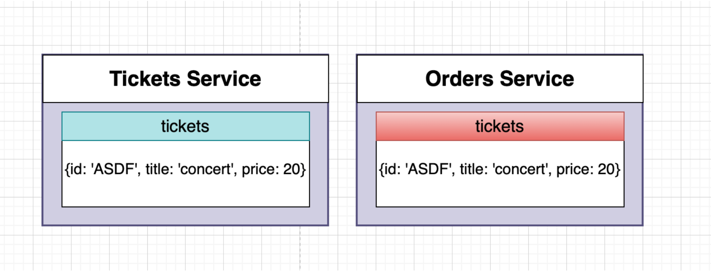
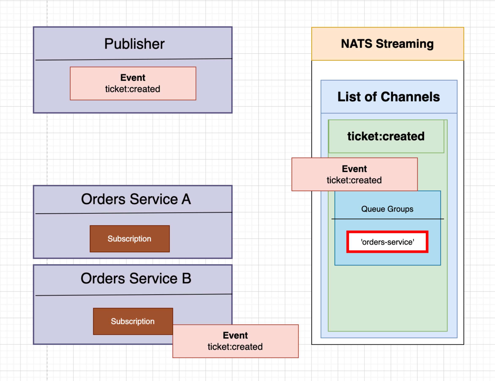

# Ticketing Microservice 👋 😎 🎃

## The project we are going to work on we are going to follow some rules in order to build a microservice.
  1. In order to avoid duplicate code we are going to build a central library as an NPM module to share code between our different projects.
  2. We will define all our events in this shared library.
  3. We are going to write everything in Typescript.
  4. Introduced a lot of code to handle concurrency issues.


## We have built a ticketing app. In our application
  1. Users can list a ticket for an event for sale.
  2. Other users can purchase this ticket.
  3. Any users can list tickets for sale and purchase tickets. 
  4. When a user attempts to purchase a ticket, the ticket is locked for 15 minutes. The user can have 15 minutes to enter their payment info.
  5. While locked, no other user can purchase the ticket. After 15 minutes, the ticket should be unlocked. So 15 minutes buy it or not. That’s all you get.
  6. Ticket prices can be edited if they are not locked. This is going to demonstrate a big challenge around asynchronous communication in microservices. Imagine a scenario in which some user out there lists a ticket for $100 and then some amount of time later, another user clicks on the purchase ticket. Let’s imagine at the same exact point in time, the user who owns the ticket and who listed it changes the price to $1000. So at the same time one person tries to lock it and at the same time someone else is trying to change the price. 

### We have to figure out how to handle these events in some very precise, well codified, testable fashion.


## Types of Resources


Here this order is an attempt to purchase a ticket. The order object represents the intent to purchase a ticket. Here expiresAt represents the 15 minutes, as soon as the user pays for the order, we will change the status “Completed”. 


Here the Charge object is going to represent our ability to actually charge some persons credit card and get some money out of them. 


## Services

We are going to end up with five different services. 


List of different events we are going to create. The main purpose of showing this events right now is just to give you a picture of some of the different events we are going to create. 


## Event & Architecture Design


We are going to have a react client application that is going to incharge of showing some content inside the browser. We are going to build this react application using next js. 
Then we are going to have auth, tickets, orders, payments and expiration that are all going to be simple node servers. Each one of them is going to be running express. Each of these different services are going to have some persistent storage in the form of MongoDB.


We are using Redis on expiration for a very particular reason. Each of these different services are going to be making use of a shared common library. This common library is going to be an NPM module that I am going to build to share code among these different services. 

Initially I would like to start with the auth service. 


## Scaffold Config File

This scaffold config file is going to watch our infra directory. Any time we make a change to a config file, it will automatically apply to our cluster. It’s also going to make sure that anytime we change any code in our auth directory, it will sync all the files inside there with appropriate running containers inside our cluster. We can create this scaffold config file inside our root project directory. 


To access anything inside our cluster we can either set up node port services or we can set up ingress service. 
Ingress is all about having some routing rules tied to engine x, so at any time a request comes into our cluster, it will be handled by that ingress service. They will be routed off to the appropriate service within our cluster. 
We will make sure here that any time a request comes in for a request url for example: /api/users we are going to send it off to our auth service. 


## Expose Secret to all our different microservices


This is a diagram of our kubernetes node. Inside of it there are many different pods. All of these different pods running a container that needs to be somehow get access to json web token signin key. We have created a new kind of object inside our cluster - Secret. 
Inside of this object we can store little key value pairs of information. Once we create the secret, we can load it into the containers that are created inside all of our different pods. 
This Secret is going to be exposed as an environment variable. So when I’m saying that there is an environment variable inside the pod, the environment variable is inside the same container as the application. That’s how we store the JWT sign in key in one location securely and we can make that available to all our different services that need it. 


## Creating a Secret

 ```bash
    kubectl create secret generic jwt-secret –from-literal=jwt=asdf
  ```
  
The one downside create secret this way any time we start to create spring up a new cluster, we have to remember all the different secrets that we have created over time.


## Testing with Microservices


Few dependencies to test setup up and running. These test dependencies we are going to install are going to be marked as development dependencies. Because we don’t want to run these tests inside our images. As we are building these images, we don’t want any of these dependencies. 


 ```bash
    npm install - -save-dev @types/jest @types/supertest jest ts-jest supertest mongodb-memory-server
 ```

The reason we are running a copy of mongo in memory, so that we can easily test multiple databases at the same time. We want to run tests for different services concurrently on the same machine.


## React Application

This is how a normal traditional react application works in a development setting. In development settings we run some normal react app. Any time a user types in a URL to their browser that’s going to point them to the react application. We are going to probably end up making at least two requests, but usually end up making three. The very first request is going to fetch us an HTML file that is pretty much empty except for some very basic script tags inside of it. The browser will make a follow up request, possibly several requests to get some additional JavaScript files. The browser will then execute all the JavaScript code or react application will start up and the react app will possibly decide that it needs to make some follow up requests to fetch some data. It might make a request to the order service to get a list of orders. 
At least two, probably three or more requests just to show some content to a user. 


So rather than taking this traditional approach, we are going to be using server side rendering instead. In a server side rendering approach, the browser is going to make a request to our next js development server. The next js development server is then going to internally make a couple of requests to different services to fetch some data. It might make a request over to the order service or the ticketing service to get a list of orders/ticketing. 
The next js development server is going to take that data to build out a full HTML document which has a ton of content rendered into it. It’s then going to take that HTML and send it back to the user’s browser all in one single request.


So there are several reasons we are making use of server side rendering here. The most important reason for the context of this application is I would like to show how to set up server side rendering in the context of microservices. But there are several other reasons to use this. First off, a user is going to see some content up here on the screen much more quickly. Server side rendered applications tend to fare a lot better with search engine optimization.


## Ticket Service

Whenever someone comes to our service and tries to create a ticket or edit one, we probably want to make sure that the user is logged in. We require authentication for a user to create or edit a ticket. So the ticket service needs a middleware inside of it to make sure the user is authenticated. We have already created a lot of functionality inside one of our service that we need that we actually need inside our ticket service. We can bring all the logic from auth service into a shared library that we are going to start to use between all of our different services. Ticket service is going to come together so much more quickly than the time that we spent on Auth service by moving core foundation logic. 

In summary, we are going to extract the shared logic into a shared library and then make sure that we can use this library inside of our different services.


We can publish all the common code as an NPM package. We can then publish this as a package to the NPM registry. Then each of our different services that need that common code, we will simply install it as a NPM dependency. 


But this definitely solves a lot of issues, but there are some big downsides. Any time we want to change our common code, we are going to have to make our change, push it up to the NPM registry, then go over to our different services and update our version to the latest. That is a tedious process. We can write out a script that’s going to kind of automate some of the stuff for us.


## Different routes to build Ticket microservice


## Connecting to NATS


We won’t use class Listener directly in our project. Instead we are going to subclass this listener into TicketCreatedListener and OrderUpdatedListener
Inside these subclasses we are going to put together some different options to make sure it listens specifically to the “ticket:created” event or “order:updated” events. We will customise the subject we are going to listen to and we will also customise the onMessage method we will listen to. 


We are going to define this Listener class inside a common module. We can then import this in different services we are going to create. Then from each of these services that we are going to subclass Listener and create some custom Listener that is going to work specifically for say PaumentService or TicketService or whatever other service we are going to create.
Listener is a blueprint, it is a guide how to create a Listener. We will implement this in each of our different services. 


We have centralised a lot of information in the common module. The common module is now going to be the primary source where we define all our event names. We will also store the exact definition of all of our different events. We are not going to define any of our events inside different services. Instead we would import them from the common module. This will ensure that all of our different services will use the same event name, and data inside of these events will always be consistent.


## Order Service

### Initially we will show all the different tickets.


### When a user clicks on a ticket inorder to purchase it. It will navigate users to this page to purchase this ticket. 


### When the user clicks on the purchase button, it will take the user to another page which will inform the user that they have 30 seconds to purchase the ticket. This order service is all about keeping track of who is attempting to purchase a ticket at any given time. It will lock down the ticket and not allow anyone to purchase it for the next 30 seconds. When the time passes ticket then will become unlock and someone else will be able to purchase it. 


The order needs to know what ticket it is trying to lock down and price of the ticket. 

We are trying to replicate the ticket data in order service, order service needs to listen to two kinds of events. It’s going to listen to ticket created events and ticket updated events coming from ticket service. 


![My Image](images/image-19.png


The version property inside Ticket: We can avoid concurrency issues with NATS streaming server using this version flag. 


Here ticket service is emitting a series of events all about one kind of ticket being updated

  1. Ticket with id: abc,  we are going to update it price to 10 
  2. Then same ticket price is changed to 20 and 30

So the last updated ticket with id: abc price is 30

At nats streaming server it is entirely possible these events will end up going over to the server in totally different order. We can’t rely upon the order of events coming into our order service correctly. That’s why we need version property or order to track the sequence of updates.


Inside the order service, inside our Ticket collection, the version is a plane number that describes exactly what version of ticket this is. Everytime we change some attribute in the ticket itself, we update the version number inside the Ticket service. The ticket service will then emit an event, and inside that event we will print out the version number. Then inside our order service when we receive these events, we can reference these version numbers to 
make sure we are processing these events in the correct order. 


Inside the common library we are going to define all the possible order status we can have.
Rather than write our hard coded string in each service, we can manage order status in a central location and share among those services that care about those statuses.


## Event Published by each Service

The reason we are creating order:created and order:cancelled event. The goal of order:created is to tell every other service that an order has been created. 
A Payment service needs to know there is some kind of new order and some user might attempt to submit some payment in the form of a credit card. Payments service needs to know order created two very important reason:

  1. There is an order that needs to be paid. Because when a user tries to submit their credit card they are going to include the id of the order that they are trying to pay for. The payment service needs to know the id of the order and I should expect the payment for this. 
  2. How much this order cost - payment service also needs to know this. Payment service expects this amount of money.  


Order:Created also going to be published to the Expiration service and this service needs to start a 15 minute timer to time out this order. This service will expire after this specific amount of time. 


Ticket service also needs to know when the order is created. Ticket service needs to lock down the ticket and prevent editing. 
We can imagine a case where a user goes to purchase a ticket which would cost him twenty dollars. When the user creates the order right after two minutes, the person who is selling the ticket goes to the ticket service and adjusts the price to 30 dollars. We definitely want to prevent that from happening. 
There is one more event order service that will publish and that is order:cancelled event. 
That will unreserve a ticket from ticket service and the person who owns the ticket can change the ticket information. 
Payment service also listens for order:cancelled event, and it tells the payment service that any incoming payments for this order should be rejected.


So these are the two events we are going to emit from order service. 

## Events published by Orders Service - Listeners [Tickets, Payments & Expiration]


## Events published by Orders Service - Listeners [Tickets & Payments]


## Events published by Each Service


## Listeners we have to build in Orders service


Here we can see that the ‘ticket:created’ event is coming to order service. The reason we are listening to this event inside the order service is to locally save the new ticket. This is a classic example of data replication between services. When an order service needs to know any details about a ticket, it does not have to do synchronous communication over to the ticket service to learn about different tickets that are available. 




One thing we need to remember whenever we are replicating data across services we want to try to make sure we are using consistent id between them. That is going to make sure we can identify these unique records between all these services. We want to make sure the ticket we are saving in order service maintains the same unique id of ticket service.

## Ticket Created Listener - Queue Group Name

Here we have a publisher at the top left side which is going to publish a ticket created event. In the NATS Streaming server there is a channel ticket:created. Two instances of order service are listening to the ‘ticket:created’ channel. When these two orders service connect with this channel and create a subscription, they join a queue group called ‘orders-service’.
By being a member of this queue group that ensures any time an event comes into this channel, this event is only going to be sent to one of the members of the queue group. We want to make sure that both order services all independently process the same event at the same time. So the queue group makes sure this event is only going to be sent either order service A or order service B. We have to make sure the name of the queue group must be consistent over time. Another requirement of this queue group identifier is that it is unique to all the different services that are going to create subscriptions inside this ‘ticket:created’ channel. 





## How to solve concurrency issue

Here we are going to make a series of three requests. First we are going to create a ticket with price 5 then we update the price 10 and 15. Inside our ticket service we will process these requests. We are going to assign the version number in the order we receive the request in ticket service. Then we are going to produce a ‘ticket:created’ event. This version based event will flow to the nats streaming server and will pass through one of our orders services. Inside our orders service we will have a look at this event since we are creating the record first time for the id ‘CZQ’ so we will accept the event included version 1. 
Suppose we get two follow up requests immediately with price 10 and 15. So whenever we make an update in our ticket service we also increment the version number. So naturally we will emit two separate events having version number 2 and 3.


Order service will process those events checking the version number. If we accidentally process these events out of order. Imagine the order service received the ‘ticket:update’ event having version 3 before 2. We will take a look in our database for the id ‘CZQ’ - which has version 1. But we received an event with version 3 in the order service. That means we have already missed one version-2. So we would throw some kind of error mentioning that we can not process an out of order version event. So our order listener will time out processing this event because it will not call ack function. Because we won’t acknowledge this event, nats streaming server will re-emit the same event after a specific period of seconds. So In that specific time window we are expecting that current event would show up in the order service listener.


### So when exactly can we increment the version number of a record with an event?

We can increment the version number whenever the primary service responsible for a record emits an event to describe a create/update/destroy to a record. 

Here the tickets service produces the version number and the orders service consumes the version number. 


## Locking a Ticket Strategies

Whenever an order created listener is called in the ticket service, we need to find the associated ticket and lock it down.


We can record the order id if we want to lock the ticket and we can decide whether or not the ticket is currently reserved and it will prevent the owner editing the ticket. By default all tickets will be created with a null value in OrderId column. 

## Events Published by Expiration Service


## Expiration Service - Listener Creation

We are going to implement this in a top down approach. Initially the expiration service would listen  for order:created event.  Then we have to set up Bull JS and create a publisher for expiration:complete event.


We will create a queue which is a main abstraction inside a bull. It represents some series of messages we want to queue up and process over time. We would use bull specifically to create a queue and also what we are going to do with the messages that are flowing through it. Finally this is what going to happen inside our application:


Once we receive the order:created event in expiration service, and then we will use this expirationQueue to queue up or we can say creating a new job. We can think of a job very similar in nature to an event from nats streaming server.  So we have to write some code to publish or enqueue a job in the redis server. Inside the redis server there will be a list of different jobs with some specific job type. Job that we publish is going to be temporarily stored inside the redis server until some specified time period, let's say 20 minutes. Once that time has elapsed, the redis server is going to take that job and send it back out for the expiration queue. Inside the expiration queue we have to write some code to process this incoming job. Inside our job processing code we can emit an event ‘expiration:complete’.
We can store order id inside the job to identify which order we would expire.


